<picture>
  <source media="(prefers-color-scheme: dark)" srcset="assets/hero-ghost-dark.svg">
  
</picture>

## About Me

*AI-Native Chief Product Officer & 4 x Digital Bank Builder*

Working within demanding regulatory frameworks and diverse financial constraints, I build, launch, and scale AI-native businesses, develop compelling and profitable commercial models, and elevate customer experiences in high-pressure environments. Launching three digital banks in three different markets over the past 10 years has helped me develop a deep expertise in the development of digital products in a variety of contexts, including B2B, B2B, and B2B2C.

I'm spending my free time working on all things AI Product, figuring out how to truly harness the power of AI as a force-multiplier of my thinking. Take a look at my /productowner repo if you want to see how I am currently working and structuring my thinking!

<!--
  Hero art is generated from the dh mark. Rebuild with:  node tools/gen.js assets
  gen.js also emits two alternate directions (hero-construction-*, hero-specimen-*);
  swap the two filenames in the <picture> block above to use one.
-->
